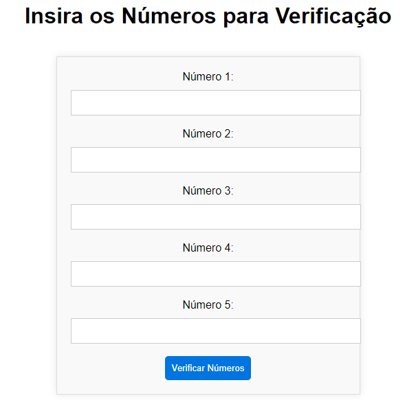

# estruturafuncao

## 📋Descrição
Este é um simples sitepara verificar propriedades de números inseridos. Ele solicita ao usuário que insira cinco números e, em seguida, verifica se cada número é par ou ímpar, redondo ou não redondo (múltiplo de 10), positivo, negativo ou zero. Foi desenvolvido para a diciplina de Programação Web II com orientação do docente Leonardo Rocha na instituição de ensino Escola Social Marista Irmão Acácio.
Esse site foi criado como exemplo de uso de HTML e PHP para processamento de formulários simples.

## 🚧 Finalizado

## 🔧 Modo de uso
O usuário deve inserir cinco números nos campos fornecidos, em seguida, basta clicar no botão "Verificar Números" para ver os resultados da verificação.

### 🛠️ Tecnologia ultilizadas
 |   
> |   | |
| :---: | :---: | :---: | :---: | :---: |

## ✒️ Autores
| [ Hanelise Naves Amorim](https://github.com/hiseamorim) |  [ Leonardo Rocha](https://github.com/LeonardoRochaMarista) |  [ Marista Escola Social Ir. Acácio](https://github.com/MaristaIrAcacio) | 
| :---: | :---: | :---: | 